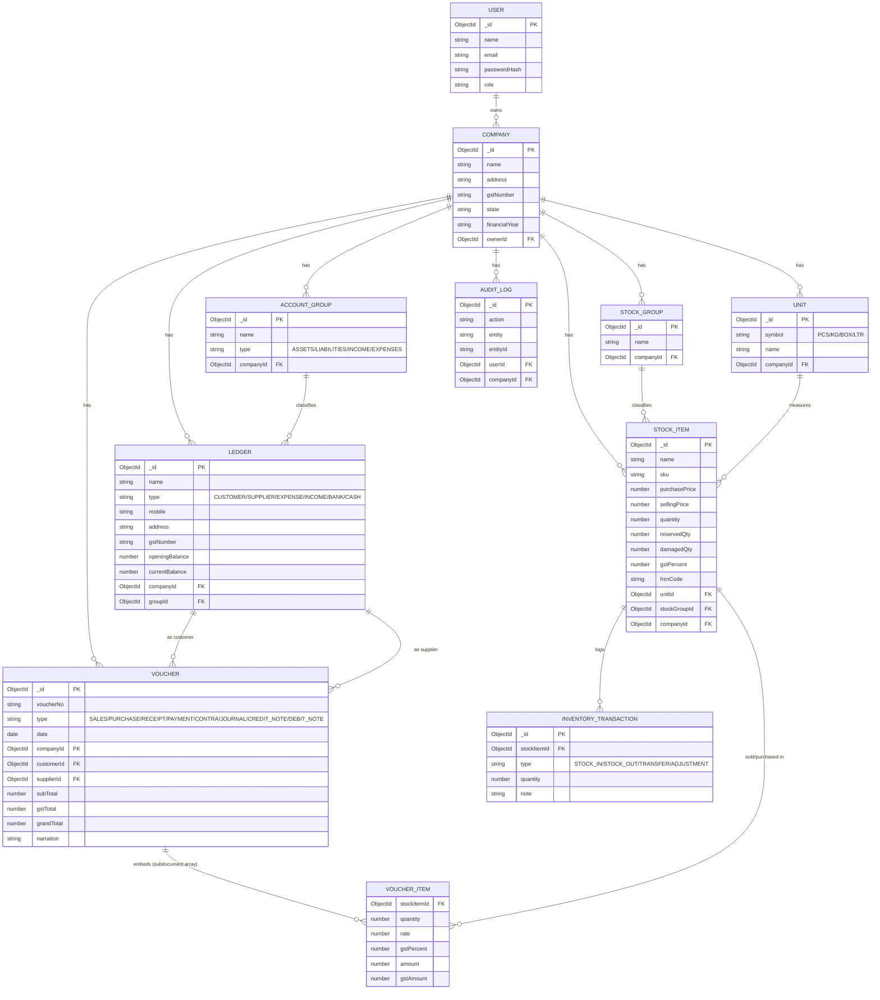
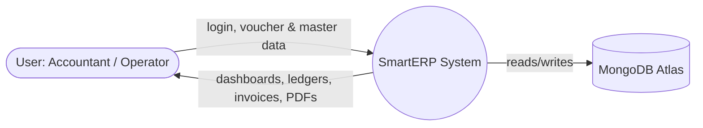
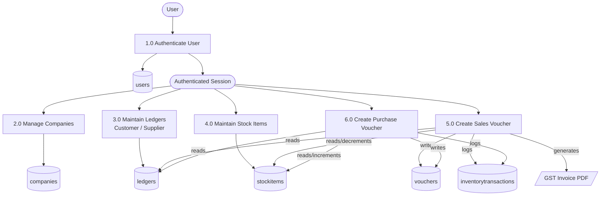

# SmartERP

**Billing, Inventory & Accounting Management System** — a Tally-inspired, keyboard-first, cloud-based ERP web application.

This repo is a monorepo with two apps:

```
smarterp/
├── backend/     Node.js + Express + MongoDB Atlas (Mongoose) REST API
├── frontend/    Next.js (plain JavaScript) + Tailwind + TanStack Table
├── render.yaml  Render deploy config (backend)
└── README.md
```

**MVP scope implemented end-to-end:** Company management, Ledgers (Customer / Supplier / Stock Item), and Vouchers (Sales / Purchase) — with auto voucher numbering, automatic stock in/out, automatic outstanding-balance updates, and PDF invoice generation. The database models and folder structure already include the rest of the concept (Groups, Units, Banking, Payroll, GST, Reports, Audit Log) so those modules can be added without restructuring anything.

---

## 1. Tech Stack

| Layer | Technology |
|---|---|
| Frontend | Next.js 14 (App Router), React 18, **JavaScript (no TypeScript)**, Tailwind CSS, ShadCN-style components, TanStack Table |
| Backend | Node.js, Express.js, Zod validation |
| Database | **MongoDB Atlas**, accessed via Mongoose ODM |
| Auth | JWT (email + password, bcrypt-hashed) |
| PDF | PDFKit (GST invoice generation) |
| Excel | ExcelJS (wired for report export) |
| Deployment | Frontend → Vercel · Backend → Render · Database → MongoDB Atlas |

---

## 2. Module Overview

| Module | Status | Notes |
|---|---|---|
| Auth (login/register) | ✅ MVP | JWT, bcrypt password hashing |
| Company Selection (max 5) | ✅ MVP | Create / Select / Alter / Delete |
| Gateway of SmartERP (dashboard) | ✅ MVP | Menu shell for all modules |
| Masters → Customer Ledger | ✅ MVP | Create / Alter / Delete / Search / Statement |
| Masters → Supplier Ledger | ✅ MVP | Create / Alter / Delete / Search / Statement |
| Masters → Stock Item | ✅ MVP | Name, SKU, purchase/selling price, qty, GST% |
| Vouchers → Sales / Customer Bill | ✅ MVP | Auto invoice no., stock ↓, customer due ↑, PDF |
| Vouchers → Purchase / Stock Entry | ✅ MVP | Auto voucher no., stock ↑, supplier due ↑ |
| Groups, Stock Groups, Units | 🧩 Schema ready | Mongoose models exist; UI not yet built |
| Contra / Payment / Receipt / Journal | 🧩 Schema ready | `Voucher.type` enum already supports these |
| Credit Note / Debit Note | 🧩 Schema ready | `Voucher.type` enum already supports these |
| Inventory (transfer, adjustment, valuation) | 🧩 Schema ready | `InventoryTransaction` model logs stock in/out today |
| Banking, Payroll, GST reports, Financial reports | 🚧 Planned | Not part of MVP scope |
| Keyboard-only navigation | ✅ Partial | Global + Masters + Voucher shortcuts wired; see §6 |
| Email Invoice | ❌ Excluded | Explicitly out of scope per project requirements |

---

## 3. Application Flow

```
Login (email/password or admin-created account)
        │
        ▼
Company Selection  (max 5 companies · Create / Select / Alter / Delete)
        │
        ▼
Gateway of SmartERP (dashboard)
        │
   ┌────┼─────────────┬───────────────┐
   ▼    ▼              ▼               ▼
Masters  Transactions   Inventory*   Reports*
(Ledgers, (Sales / Purchase           (*schema ready,
 Stock)    Vouchers)                   UI planned)
```

---

## 4. Entity–Relationship / Collection Diagram

MongoDB is document-based, so there are no enforced foreign keys — relationships below are maintained by storing a referenced document's `_id` and using Mongoose `.populate()` to join at query time (see `backend/src/models/`). The diagram is drawn in the familiar ER style since it maps directly onto the actual reference fields in each schema.



Note: `VOUCHER_ITEM` is not a separate MongoDB collection — it's an **embedded subdocument array** on `Voucher.items` (see `backend/src/models/Voucher.js`), which is the idiomatic MongoDB way to model a one-to-many "line items" relationship that's always read/written together with its parent.

Full field-level definitions live in `backend/src/models/*.js` — those files are the source of truth; the diagram above mirrors them.

---

## 5. Data Flow Diagram

### Level 0 — Context Diagram



### Level 1 — Major Processes (MVP)



Each voucher save runs inside a **Mongo multi-document transaction** (`mongoose.startSession()` + `session.withTransaction()`): the voucher document (with embedded line items) is created, the related stock item quantities are adjusted, an inventory transaction is logged, and the customer/supplier `currentBalance` is updated — all or nothing (see `backend/src/routes/vouchers.js`). MongoDB Atlas clusters (including the free M0 tier) run as replica sets, so transactions work out of the box.

---

## 6. Keyboard Shortcuts (implemented subset)

| Key | Action |
|---|---|
| `F1` | Company Selection |
| `F8` | Sales Voucher |
| `F9` | Purchase Voucher |
| `ALT + L` | Create Ledger (Customer) |
| `ALT + S` | Create Stock Item |
| `CTRL + C` | New/List Customer |
| `CTRL + S` | New/List Supplier |
| `CTRL + H` | Home (Gateway) |
| `CTRL + Q` | Logout |
| `ESC` | Previous screen |

The full shortcut map from the spec (F2–F10, ALT/CTRL combos for Inventory, Billing, Reports, etc.) is documented for future modules but only the shortcuts above are wired to a screen today, since those are the only screens that exist. Extend `frontend/src/hooks/useKeyboardShortcuts.js` as new modules are added. Note: `CTRL+M` (Email Invoice) from the original shortcut list is intentionally **not** implemented, since Email Invoice is excluded from scope.

---

## 7. Local Development

### Prerequisites
- Node.js 18+
- A [MongoDB Atlas](https://www.mongodb.com/cloud/atlas/register) cluster (the free M0 tier works fine)

### 7.1 Create your MongoDB Atlas database
1. Sign up / log in at MongoDB Atlas and create a free **M0** cluster.
2. Under **Database Access**, create a database user with a password.
3. Under **Network Access**, add your current IP (or `0.0.0.0/0` for quick local testing — tighten this before going live).
4. Click **Connect → Drivers**, copy the `mongodb+srv://...` connection string.

### 7.2 Backend

```bash
cd backend
cp .env.example .env      # paste your MONGODB_URI and set a JWT_SECRET
npm install
npm run seed                # optional: creates a demo company + login
npm run dev                 # http://localhost:4000
```

Seeded demo login: `admin@smarterp.dev` / `password123`

### 7.3 Frontend

```bash
cd frontend
cp .env.local.example .env.local   # NEXT_PUBLIC_API_URL=http://localhost:4000/api
npm install
npm run dev                         # http://localhost:3000
```

Visit **http://localhost:3000** — it'll redirect to the login page.

---

## 8. Deployment

### 8.1 GitHub
Push this whole folder as one repository. The structure assumes a single repo with `backend/` and `frontend/` as subfolders, which both Vercel and Render support via a configurable **root directory**.

```bash
git init
git add .
git commit -m "SmartERP MVP: auth, companies, ledgers, sales & purchase vouchers (MongoDB Atlas)"
git branch -M main
git remote add origin https://github.com/<your-username>/smarterp.git
git push -u origin main
```

### 8.2 Database — MongoDB Atlas
Already set up in §7.1. For production, go back to **Network Access** and either allowlist Render's outbound IPs or (simplest) allow `0.0.0.0/0` — Atlas still requires the username/password to connect, so this is commonly used for services with dynamic IPs like Render's free tier.

### 8.3 Backend → Render
1. New **Web Service** on Render, point it at the GitHub repo.
2. Root directory: `backend`
3. Build command: `npm install`
4. Start command: `npm start`
5. Environment variables: `MONGODB_URI`, `JWT_SECRET`, `JWT_EXPIRES_IN=8h`, `CORS_ORIGIN=<your-vercel-url>`, `PORT=4000`

(`render.yaml` in the repo root captures this config for Render's Blueprint deploys.)

### 8.4 Frontend → Vercel
1. New Project on Vercel, import the same GitHub repo.
2. Root directory: `frontend`
3. Framework preset: Next.js (auto-detected)
4. Environment variable: `NEXT_PUBLIC_API_URL=https://<your-render-service>.onrender.com/api`
5. Deploy.

### 8.5 Post-deploy checklist
- [ ] Update the backend's `CORS_ORIGIN` to the final Vercel URL (redeploy after changing).
- [ ] Confirm Atlas **Network Access** allows connections from Render.
- [ ] Log in, create a company, add a customer + supplier + stock item, and post one Sales and one Purchase voucher to confirm the full flow works end-to-end in production.

---

## 9. Project Structure

```
backend/
├── scripts/
│   └── seed.js               # demo company + ledgers + stock
├── src/
│   ├── server.js              # Express app entry point (connects Mongo, then listens)
│   ├── db.js                   # Mongoose connection helper
│   ├── models/
│   │   ├── plugins.js          # shared toJSON transform (_id -> id)
│   │   ├── User.js
│   │   ├── Company.js
│   │   ├── Ledger.js           # Customer/Supplier/Expense/Income/Bank/Cash
│   │   ├── StockItem.js        # + InventoryTransaction
│   │   ├── Voucher.js          # Sales/Purchase/... with embedded line items
│   │   ├── masters.js          # AccountGroup, Unit, StockGroup
│   │   └── AuditLog.js
│   ├── middleware/auth.js      # JWT auth + company-ownership guard
│   ├── routes/
│   │   ├── auth.js             # register/login
│   │   ├── companies.js        # company CRUD (max 5/user)
│   │   ├── ledgers.js          # customer/supplier/stock-item CRUD + statements
│   │   └── vouchers.js         # sales & purchase voucher logic (Mongo transactions) + PDF
│   └── utils/
│       ├── voucherNumber.js    # sequential voucher numbering
│       └── pdf.js               # PDFKit invoice generator
frontend/
├── src/
│   ├── app/                       # plain .jsx pages (no TypeScript)
│   │   ├── login/page.jsx
│   │   ├── companies/page.jsx
│   │   └── dashboard/[companyId]/
│   │       ├── page.jsx                     # Gateway of SmartERP
│   │       ├── masters/ledgers/customers/
│   │       ├── masters/ledgers/suppliers/
│   │       ├── masters/stock-items/
│   │       └── vouchers/{sales,purchase}/
│   ├── components/
│   │   ├── ui/                # Button, Input, Card, DataTable, Select…
│   │   ├── layout/KeyBar.jsx  # persistent function-key strip
│   │   ├── masters/LedgerMasterView.jsx
│   │   └── vouchers/VoucherFormView.jsx
│   ├── hooks/useKeyboardShortcuts.js
│   └── lib/api.js             # fetch client with JWT attach
```

---

## 10. Design Notes

The UI follows a "console" visual language deliberately built to reference Tally's own blue-screen, keyboard-driven heritage: a deep navy backdrop, an amber accent reserved for function-key badges, and a monospaced data grid for ledgers and vouchers. The persistent bottom **function-key strip** (`KeyBar`) is the signature element — a modernized, clickable rebuild of Tally's bottom F-key bar that also documents the active shortcuts on every screen.
